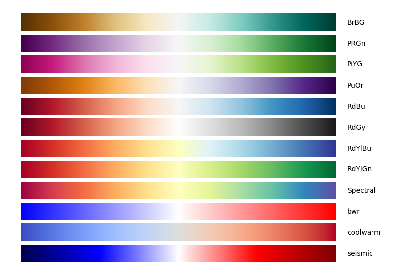

Colormap
############

.. image:: https://badge.fury.io/py/colormap.svg
       :target: https://pypi.python.org/pypi/colormap

.. image:: https://secure.travis-ci.org/cokelaer/colormap.png
       :target: http://travis-ci.org/cokelaer/colormap

.. image:: https://coveralls.io/repos/cokelaer/colormap/badge.png?branch=master 
       :target: https://coveralls.io/r/cokelaer/colormap?branch=master 

:version: Python 3.6, 3.7, 3.8, 3.9
:contributions: Please join https://github.com/cokelaer/colormap
:issues: Please use https://github.com/cokelaer/colormap/issues
:notebook: Please see https://github.com/cokelaer/colormap/tree/master/notebooks

What is it ?
################

**colormap** package provides simple utilities to convert colors between
RGB, HEX, HLS, HUV and a class to easily build colormaps for matplotlib. All
matplotlib colormaps and some R colormaps are available altogether. The
plot_colormap method (see below) is handy to quickly pick up a colormaps and
the test_colormap function is useful to see/test a new colormap.

Installation
###################

Prerequisites
===============

You will need to install `Python <http://www.python.org/download/>`_
(linux and mac users should have it installed already). We recommend also to install `ipython <http://ipython.org/>`_, which provides a more flexible shell alternative to the python shell itself. **colormap** requires **matplotlib** and **easydev**, which are available on pypi and installed automatically with this package.

Installation
================
Since **colormap** is available on `PyPi <http://pypi.python.org/colormap>`_, the following command should install the package and its dependencies automatically:: 

    pip install colormap

colormap is also available on Conda (conda-forge)::

    conda install colormap

Examples
##########

Using the :class:`~colormap.colors.Colormap` class
=====================================================

Create your own colormap from red to green colors with intermediate color as
whitish (diverging map from red to green):

.. plot::
    :include-source:
    :width: 60%

    from colormap import Colormap
    c = Colormap()
    mycmap = c.cmap_linear('red', 'white', 'green(w3c)')
    c.test_colormap(mycmap)

Using the aliases
=====================================================

Without creating an instance of **Colormap**, you can use these functions:

.. plot::
    :include-source:
    :width: 60%

    from colormap import cmap_builder, test_cmap
    mycm = cmap_builder('red', 'black', 'yellow')
    test_cmap(mycm)

Visualise set of colormap
=============================

Another convenient feature is to look at a set of colormaps altogether::

    c = Colormap()
    c.plot_colormap('diverging')

Other set names are:

- sequentials2,
- misc
- diverging
- diverging_black
- qualitative

See user guide for details.

User Guide
##################

.. toctree::
    :maxdepth: 2
    :numbered:

    quickstart.rst

Reference Guide
##################

.. toctree::
    :maxdepth: 2
    :numbered:

    references

